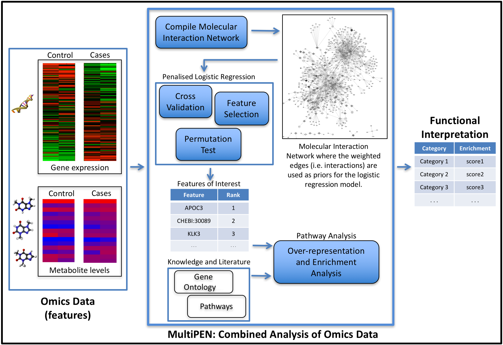
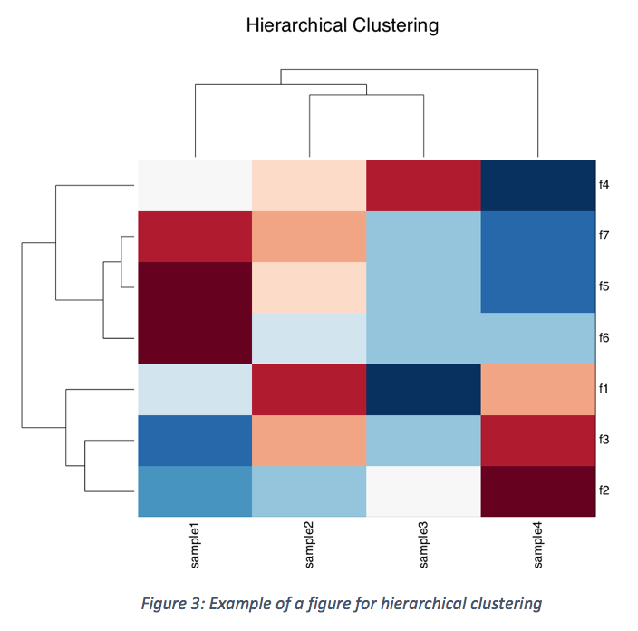

# MultiPEN

MultiPEN uses a penalised logistic regression approach to find a subset of features (genes and/or metabolites) that hold more discriminant power to separate two classes: control and cases. This approach uses a molecular interaction network (e.g., protein-protein interaction network or metabolic network) to find the largest connected component that best separates the two conditions (for details on the logistic regression program to be optimised refer to [1]).


[The Workflow](#the-workflow)

[Getting Started](#getting-started)

[Data Analysis](#data-analysis)

- [Hierarchical Clustering](#hierarchical-clustering)

- [Cross Validation](#cross-validation)

- [Feature Selection](#feature-selection)


[References](#references)


# The Workflow

The tool can analyse gene expression data and/or metabolomics data. The first step is to compile a molecular network for which we use StringDB [2][3] and Pathway Commons [4]. 



*The workflow to analyse omics data with MultiPEN*

The following sections describe these modules.


# Getting Started

## MATLAB Runtime

MultiPEN is shared as a MATLAB stand-alone application, which requires the installation of the MATLAB Runtime for R2015b in your system. To install MATLAB Runtime: 

1.	Download and save MATLAB Runtime for R2015b for your operating system which can be found from:
http://www.mathworks.com/products/compiler/mcr/index.html 

2.	Double click the installer and follow the instructions in the installation wizard.


## MultiPEN

Download MultiPEN from: [MultiPEN](https://github.com/wjurkowski/MultiPEN/blob/master/MultiPEN_executable/MultiPEN_v001_OS.zip)

The zip folder contains:

**MultiPEN**
Application

**ExampleInputs**
Contains:
expressionData.txt
interactionMatrix.txt
sampleClass.txt

**Scripts to run examples**

*example_cross_validation.sh*

*example_feature_selection.sh*


# Data Analysis

After downloading and decompresing the application, open a terminal. In the command line, navigate to the folder where the binary for MultiPEN is located, i.e., binary-OS/MultiPEN_v001_OS/.
 
## Cross Validation

A common practice in the machine learning community is to first solve for the parameter that optimises the logistic regression problem in Equation 1 for your specific data. In MultiPEN, the module to do precisely that is CrossValidation. 

### Syntax

*MultiPEN*  **CrossValidation** *OutputDirectory ExpressionData Interactions SampleClass lambdas Folds NumIterations*


### Description


Parameter | Description
----------|-------------
*MultiPEN* | This is the path to the binary executable of MultiPEN, i.e., binary-OS/MultiPEN_v001_OS/.
*OutputDirectory* | Specify directory for output files.
*ExpressionData* |  The expression data is in tabular format where the rows are the features (genes and/or metabolites) and the columns are the samples. An example of a file containing expression data is shown in Figure c).
*Interactions* |  The interaction matrix where the ith interaction (row) is represented as: [source target score] where *source* and *target* are names (symbolID for genes and CHEBI IDs for metabolites) of the connected nodes and *score* is a number in the range [0,1] representing the interaction confidence (where 1 corresponds to the maximum level of confidence). An example is shown in Figure b).
*SampleClass* | For each sample specify if control (0) or case (1). An example of this file is shown in Figure a) where each row contains the class for one sample. 
*lambdas* | Set of lambdas to test for cross validation. If you are wanting to test more than one lambda, specify the lambdas by using the notation (include the quotation mark symbols): “[lambda1 lambda2 … lambdaN]”. For example, if we want to try two lambdas, namely 0.02 and 0.2, we would specify it with: “[0.02 0.2]”.
*Folds* | Specify the number of partitions for cross validation.
*NumIterations* | Maximum number of iterations for the optimisation solver. Default value is 100.


*Examples of input files: a) File containing the class for each sample, 0 for control and 1 for cases, b) File containing the interaction matrix, c) Example of a file containing expression data*


### Cross Validation Output Files

Cross Validation produces one ouput file:

File | Description
-----|------------
cross-validation_stats.txt | Statistics for tests which include, for each lambda, the size of the largest connected component (LCC), the standard deviation of the largest connected component (std_LCC), the number of selected features (selected, i.e., features which weights are different to zero), area under the curve (AUC), and the standard deviation of the area under the curve (std_AUC).


### Example - OS

In the command line, navigate to the folder where the binary for MultiPEN is located, i.e., binary-OS/MultiPEN_v001_OS/. Then create variables for the paths to stand-alone application, output directory and input files by typing:

```
MultiPEN="MultiPEN.app/Contents/MacOS/applauncher"
OutputDirectory="ExampleOutputs/"
ExpressionData="ExampleInputs/X.txt"
Interactions="ExampleInputs/E.txt"
SampleClass="ExampleInputs/Y.txt"
lambda=0.001
Folds=3
NumIter=100
```

Note that in this example we are using the example files provided with the application. All the files used for the example are located in the folder: ExampleInputs/.

Next, run Cross Validation with the following command:

```
$MultiPEN CrossValidation $OutputDirectory $ExpressionData $Interactions $SampleClass $lambda $Folds $NumIter
```

To test more than one lambda one can specify the lambdas by using the notation (include the quotation mark and square bracket symbols): 
“[lambda1 lambda2 … lambdaN]”

For example, if we want to try two lambdas, 0.02 and 0.2, we would use the following command:

```
$MultiPEN CrossValidation $OutputDirectory $ExpressionData $Interactions $SampleClass "[0.02 0.2]" $Folds $NumIter
```


## Feature Selection

After selecting the best lambda parameter to optimise the logistic regression problem, feature selection performs the ranking of all features (genes and/or metabolites) based on their expression (genes) and/or levels (metabolites).


### Syntax

*MultiPEN* **FeatureSelection** *OutputDirectory ExpressionData Interactions SampleClass lambda DecisionThreshold NumIterations*


### Description


Parameter | Description
----------|-------------
*MultiPEN* | This is the path to the binary executable of MultiPEN, i.e., binary-OS/MultiPEN_v001_OS/.
*OutputDirectory* | Specify directory for output files.
*ExpressionData* |  The expression data is in tabular format where the rows are the features (genes and/or metabolites) and the columns are the samples. An example of a file containing expression data is shown in Figure 1 c).
*Interactions* |  The interaction matrix where the ith interaction (row) is represented as: [source target score] where *source* and *target* are names (symbolID for genes and CHEBI IDs for metabolites) of the connected nodes and *score* is a number in the range [0,1] representing the interaction confidence (where 1 corresponds to the maximum level of confidence). An example is shown in Figure 1 b).
*SampleClass* | For each sample specify if control (0) or case (1). An example of this file is shown in Figure 1 a) where each row contains the class for one sample. 
*lambda* | This is the lambda parameter that optimises the logistic regression problem for your specific data. Different lambdas can be tested using cross valiation, then selecting the value that provides better results (in terms of the size of the largest connected component, accuracy or area under the curve).  
*DecisionThreshold* | The decision threshold is set to 0.5 by default. However, if want to test another value specify it here.
*NumIterations* | Maximum number of iterations for the optimisation solver. Default value is 100.


### Feature Selection Output Files

Feature selection produces seven output files: 

File | Description
-----|------------
MultiPEN-Rankings_lambdaX.txt | Ranking of features for the corresponding lambda X
MultiPEN-Rankings_lambdaX_genes-higher-in-cases.txt | Ranking of features which includes only features with higher expression in cases samples.
MultiPEN-Rankings_lambdaX_genes-higher-in-control.txt | Ranking of features which includes only features with higher expression in control samples.
MultiPEN-vts_lambdaX.txt | Intercept term (logistic regression model)
MultiPEN-performance_feature-selection_lambdaX.txt | LCC, auc, accuracy, TP, TN, FP, FN
MultiPEN-feature-selection_config.txt | Lambda, number of iterations, decision threshold
MultiPEN-feature-selection_config.txt | Details of the parameters used to run feature selection


**MultiPEN-Rankings_lambdaX.txt**

This tabular file contains the results for the features selection. The first five columns contain the list of features, weight, ranking, fold change and the class where the feature had higher vote.  The last columns correspond to the expression data. The columns are defined as follows:


Column | Column Name | Description | Example (row 4 in Figure 2)
-------|-------------|-------------|-----------------------------
1 | name | Feature (gene and/or metabolite) name | PPOX
2 | weight | This is the weight learned by MultiPEN and it is a number in the range [-1,1]. | 0.00290391
3 | ranking | Ranking according to the absolute weight, where ranking 1 corresponds to the most significant feature for the model. | 3
4 | foldChange | Fold change to determine the expression change from control to cases. | 1.1735
5 | higherIn | The average expression is higher in case or control. | case
6 | sample_1 | First sample | case1
… | … | … | …
n+5 (n is the number of samples) | sample_n | Last sample | control7

The figure shows an example of the rankings file created with the feature selection module.


**MultiPEN-Rankings_lambda0.001_genes-higher-in-cases.txt** and **MultiPEN-Rankings_lambda0.001_genes-higher-in-control.txt**

These tabular files contain the ranking of features which includes only features with higher expression in cases samples and control samples separately. 


**MultiPEN-vts_lambda0.001.txt**
Intercept term (logistic regression model)


MultiPEN-performance_feature-selection_lambda0.001.txt | LCC, auc, accuracy, TP, TN, FP, FN
MultiPEN-feature-selection_config.txt | Lambda, number of iterations, decision threshold


** MultiPEN-feature-selection_config.txt **
File containing details of the parameters used to run feature selection: lambda, number of iterations (numIter - used to run the optimisation routine that solves the logistic regression problem) and the decision threshold (for class prediction). 


### Example - OS

*Using default decision threshold and number of iterations.*

In the command line, navigate to the folder where the binary for MultiPEN is located, i.e., binary-OS/MultiPEN_v001_OS/. Then create variables for the paths to stand-alone application, output directory and input files by typing:

```
MultiPEN="MultiPEN.app/Contents/MacOS/applauncher"
OutputDirectory="ExampleOutputs/"
ExpressionData="ExampleInputs/X.txt"
Interactions="ExampleInputs/E.txt"
SampleClass="ExampleInputs/Y.txt"
lambda=0.001
```


Next, run feature selection with the following command:

```
$MultiPEN FeatureSelection $OutputDirectory $ExpressionData $Interactions $SampleClass $lambda
```


### Running example script for feature selection

To run the script provided as example with all the default parameters, use the command:

```
./example_feature_selection.sh 
```


## Hierarchical Clustering



# References

[1] GenePEN: analysis of network activity alterations in complex diseases via the pairwise elastic net., Vlassis N, Glaab E., Stat Appl Genet Mol Biol. 2015 Apr;14(2):221-4. doi: 10.1515/sagmb-2014-0045.

[2] STRING v10: protein-protein interaction networks, integrated over the tree of life, Szklarczyk D, Franceschini A, Wyder S, Forslund K, Heller D, Huerta-Cepas J, Simonovic M, Roth A, Santos A, Tsafou KP, Kuhn M, Bork P, Jensen LJ, von Mering C., Nucleic Acids Res. 2015 Jan; 43:D447-52.

[3] STRING: a web-server to retrieve and display the repeatedly occurring neighbourhood of a gene, Snel B, Lehmann G, Bork P, Huynen MA., Nucleic Acids Res. 2000 Sep 15;28(18):3442-4.

[4] Pathway Commons, a web resource for biological pathway data, Cerami E et al., Nucleic Acids Research (2011).
